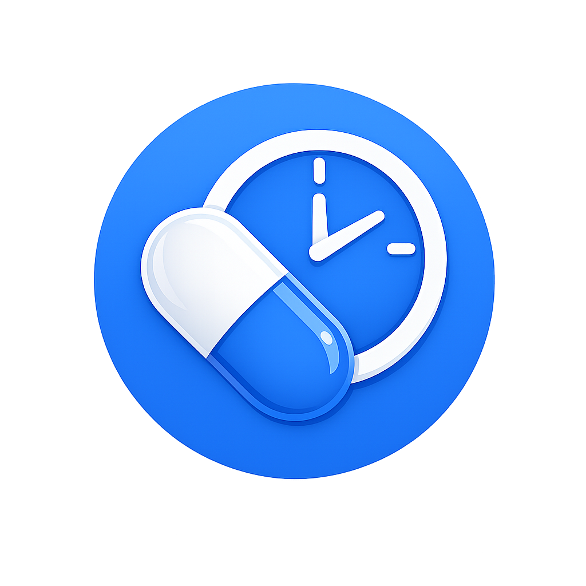

<div align="center">
  

  # DrugMe

  **A private, offline-first medication reminder for Android.**

  Reminds you when to take each medication, tracks how well you keep to it, and — only if you
  want it — keeps an end-to-end encrypted backup across your devices.
</div>

---

## Why

A medication reminder has exactly one job, and it fails silently: a dropped alarm or a
notification nobody sees looks identical to everything working. DrugMe is built around that
failure mode — the reminder engine runs entirely on-device, needs no account, and heals its
own alarm chain after reboots and OEM battery kills. An account is offered for cloud backup,
never required.

## Features

- **Dose reminders** with *Taken / Snooze / Skip* actions, at exact alarm times that survive
  reboots, time-zone changes and app-standby.
- **Flexible schedules** — several times a day, specific days of the week, or every N days,
  with optional start/end dates and food instructions ("with food", "empty stomach").
- **Adherence & punctuality stats** — how many doses you took, and how close to on-time.
- **Refill / low-stock warnings** — optional per-medication stock tracking with a run-out
  forecast.
- **Focused dashboard** — next dose, today's progress, overdue doses and important low-stock
  alerts, with reminder diagnostics and testing kept in Settings.
- **Discreet mode** — notifications that never name the drug, because a drug name on a lock
  screen is a diagnosis in disguise.
- **Schedule & history tools** — upcoming, overdue, missed and completed doses with
  date/medication/status filters, notes, an adherence strip and CSV export.
- **Global medication lookup** — offline RxNorm-derived suggestions enhanced by RxNorm,
  with synonym/typo support and attributed MedlinePlus/openFDA/DailyMed information.
- **Optional end-to-end encrypted backup & sync** via Google sign-in — see below.
- **Verified self-updates** — release builds check GitHub Releases daily, download a newer
  APK, verify its SHA-256 digest and signing certificate, then hand it to Android's installer
  for user confirmation.

## Privacy & security

Your medications stay on your phone unless you choose to back them up. If you do:

- Records are encrypted on-device with **AES-256-GCM** before they ever leave; each blob is
  bound to its record and owner so it can't be moved or swapped.
- The encryption key is wrapped with a key derived from your passphrase using **Argon2id**.
  A one-time **recovery code** is the only other way in.
- The server (Cloud Firestore) stores **only ciphertext**. No one — not Google, not the
  maintainer — can read your data. Lose both the passphrase and recovery code and it is
  unrecoverable, by design.
- Ownership is enforced by Firestore security rules and **Firebase App Check**; confidentiality
  is enforced by the encryption. Both layers, independently.

Found a security issue? See [SECURITY.md](SECURITY.md).

## Tech stack

Kotlin · Jetpack Compose (Material 3) · Room · Hilt · WorkManager · Firebase Auth + Firestore ·
Coil · BouncyCastle (Argon2)

## Building

Requires **JDK 17** and the Android SDK.

```bash
# Debug build (no Firebase project needed — a placeholder google-services.json is used,
# so sign-in and sync are inert but everything else compiles and runs):
./gradlew assembleDebug

# Unit tests:
./gradlew test
```

To enable sign-in and cloud sync, drop a real `app/google-services.json` from your own Firebase
project into place (it's gitignored). Backend hardening steps are in
[docs/firebase-hardening.md](docs/firebase-hardening.md).

Medication lookup does not require an API key. RxNorm, MedlinePlus Connect and openFDA are
queried directly over HTTPS; failures never block saving a medication or scheduling reminders.
Official information is cached for 24 hours, with a maximum seven-day cached fallback while
offline. openFDA/DailyMed sections are labeled as U.S. drug labeling in the app.

## License

[MIT](LICENSE) © 2026 Jason Mandela
